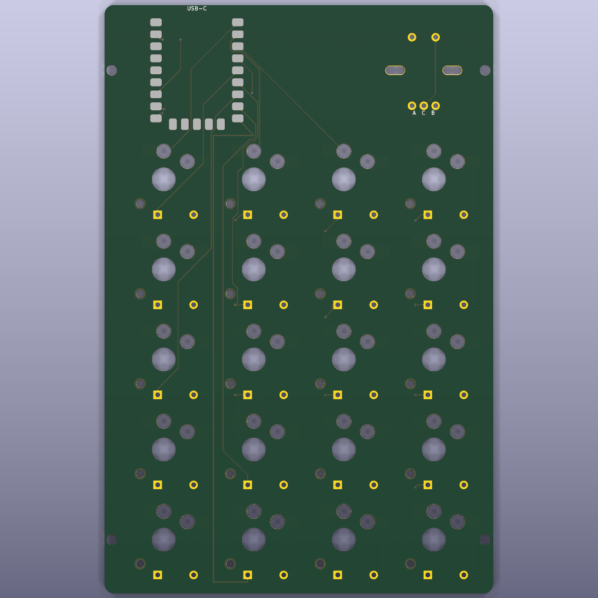

# Compact Choc V2 Numpad

[](https://github.com/nidalJaafar/compact-choc-numpad/actions/workflows/ci.yml)



The locked purchasing list is in [`BOM_FINAL.md`](BOM_FINAL.md).

> **Project status:** revision A, not yet physically manufactured. Print and
> test the 1:1 template with the exact purchased parts before ordering PCBs.

Parametric Ergogen source for a compact, wired low-profile numpad with:

- 20 Kailh PG1353 (Choc V2 / "Black Tea") tactile hot-swap positions in a 4-by-5 matrix;
- one headerless Waveshare-compatible RP2040-Zero, soldered by its castellated pads;
- rear-facing USB-C and a vertical 5-pin EC11 push encoder at the rear-right;
- 20 horizontal through-hole 1N4148 DO-35 diodes;
- four M2 mounting holes and 19.05 mm key spacing; and
- an 82.2 by 124.5 mm, 1.6 mm thick, two-layer PCB.

## Firmware: QMK

This wired, USB-first board uses **QMK**. QMK directly supports generic RP2040
boards, matrix scanning, EC11 encoders, and UF2 bootloaders. ZMK can support
RP2040 hardware too, but this particular RP2040-Zero would require additional
board integration and brings no wireless benefit to this design.

The ready-to-copy keyboard definition is in
[`firmware/qmk/compact_choc_numpad`](firmware/qmk/compact_choc_numpad). After
setting up a normal QMK checkout, build it with:

```bash
cp -R firmware/qmk/compact_choc_numpad ~/qmk_firmware/keyboards/
cd ~/qmk_firmware
qmk compile -kb compact_choc_numpad -km default
```

Hold the RP2040-Zero's BOOT button while connecting USB, then copy the produced
`.uf2` file to the `RPI-RP2` drive. The default map uses the encoder for volume,
the encoder push for mute, and places `QK_BOOT` on the Fn layer. See the
[firmware README](firmware/qmk/compact_choc_numpad/readme.md) for the complete
map and flashing notes.

## Repository layout

```text
assets/       Cedar, Beirut artwork, and keycap reference
firmware/     QMK keyboard definition and default keymap
footprints/   Project-specific Ergogen footprint generators
scripts/      Routing, case, validation, and fabrication helpers
config.yaml   Parametric Ergogen source of truth
BOM_FINAL.md  Locked purchasing list
```

The controller footprint follows Waveshare's official 18 by 23.5 mm drawing.
Buy the version **without pre-soldered headers** and confirm that any compatible
module has the same dimensions, castellated-pad order, and top-mounted USB-C
connector before soldering it.

## Generate and validate

Install the Node dependencies once:

```bash
npm install --allow-git=all
```

Install the isolated Freerouting bundle once:

```bash
npm run setup:router
```

Generate the PCB, route it, and regenerate both enclosure STLs:

```bash
npm run generate
```

The principal PCB result is:

```text
output/pcbs/compact_choc_numpad-routed.kicad_pcb
```

Run the checks and exports with:

```bash
npm run validate
npm run render
npm run print:1to1
npm run gerbers
```

`npm run validate` first synchronizes five exact embedded footprint definitions
into `output/pcbs/CompactNumpad.pretty` and relinks both PCB files through the
project-local `fp-lib-table`. The routed board then passes KiCad DRC with zero
violations, zero unconnected pads, and zero footprint errors. This validates
the actual embedded geometry without suppressing library checks.

The JLCPCB-ready fabrication archive is written to
`output/compact_choc_numpad-gerbers.zip`. It contains the two copper layers,
two solder-mask layers, two silkscreen layers, board outline, Gerber job file,
and separate plated and non-plated Excellon drill files.

## GPIO assignment

```text
GP0..GP3  COL0..COL3
GP4..GP8  ROW0..ROW4
GP14      encoder A
GP15      encoder B
GP26      encoder push
GND       encoder common and push return
```

The matrix is `COL2ROW`. The RP2040-Zero's own BOOT and RESET buttons remain
under the removable cover; there is no separate reset switch or reset opening.

## Low-profile enclosure

Generate only the Ergogen layout and enclosure with:

```bash
npm run generate:case
```

This creates:

```text
output/stl/bottom_tray.stl
output/stl/top_cover.stl
```

The tray is 13.4 mm high with a 1.6 mm floor and 3.5 mm PCB supports. The PCB
underside sits 5.1 mm above the base, leaving about 0.45 mm below the nominal
3.05 mm Choc socket envelope. The rear controller band remains 15.4 mm high
when assembled, but the complete key deck and the front/side tray walls are
stepped down by 4.4 mm. The key deck therefore sits at approximately 11 mm
above the base and exposes about 4.3 mm of the nominal PG1353 switch housing.
This is the practical minimum for the present 1.6 mm PCB, underside sockets,
through-hole diodes, RP2040-Zero, and standard EC11 body: the design allowance
above the nominal
encoder body is only about 0.2 mm. The cover retains 20 individual 16.2 mm
switch openings and 2.85 mm plastic webs between adjacent openings; it is not
one large PCB-exposing cutout. It also has an encoder opening and shallow
recessed Lebanese cedar and Beirut calligraphy engravings. USB-C access is
through a compact 11 x 6 mm window in the rear wall of the bottom tray, while
the top cover remains closed at the rear.

The cedar is generated from `assets/cedar-traced.svg`, and the Beirut
calligraphy from `assets/beirut-traced.svg`. These smooth vector traces are
derived from `assets/lebanese_flag.svg` and `assets/beirut.png`, then sampled
at approximately 0.09 mm for robust watertight booleans without visible
raster stair-stepping in the printed part. The flag artwork is derived
from the public-domain Lebanese flag by Henri Pharaon.

Print the tray floor-down. Because the exposed-switch cover has two deck
heights, print it upright on one long edge with a brim, or use slicer-generated
supports; it no longer has one broad planar exterior face. Use a low-profile
knob for a 6 mm shaft and thin (about 1 mm) rubber feet. The purchased DSA
keycaps are taller than the custom 6 mm prototype cap, so they—not the
enclosure—will set much of the finished height. Test one keycap for skirt
clearance and stem fit first.

## Ergogen web editor

Upload `output/compact_choc_numpad-ergogen-bundle.zip`, not `config.yaml`
alone. The ZIP includes all project-specific footprint scripts.

## Before manufacturing

Print `output/pdf/compact_choc_numpad-1to1.pdf` at **100% / Actual size** and
test real samples of the PG1353 switch, matching Choc socket, RP2040-Zero,
encoder, and diode. Select the listing's vertical five-pin push encoder with
the **12 mm full shaft** specified in the BOM. The universal PCB slots accept
common EC11 and PEC11R mounting tabs, but the listing's exact pin and tab
dimensions must still be checked on the paper print. The PG1353/socket
combination uses a community-derived geometry and should be physically
test-fitted before ordering the full BOM.

## Contributing

Bug reports and pull requests are welcome. Read [`CONTRIBUTING.md`](CONTRIBUTING.md)
before changing mechanical dimensions or footprint geometry. Generated files
under `output/` are intentionally not committed; GitHub Actions regenerates the
core layout from source on every push and pull request.

## License

No project-wide open-source license has been selected yet. Until the owner adds
one, the original project files are all rights reserved. Third-party assets and
vendored libraries retain their own licenses and attribution; see
[`THIRD_PARTY_NOTICES.md`](THIRD_PARTY_NOTICES.md).
